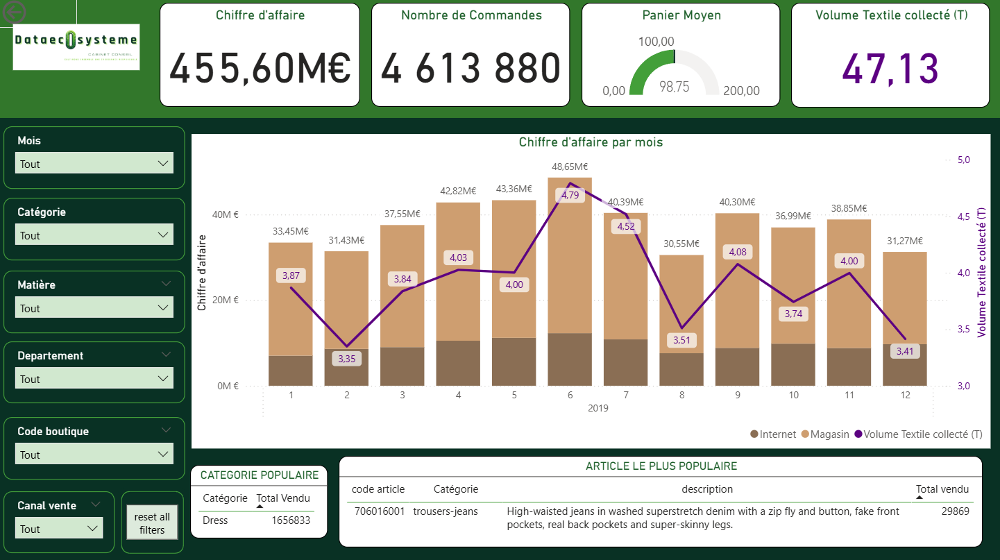
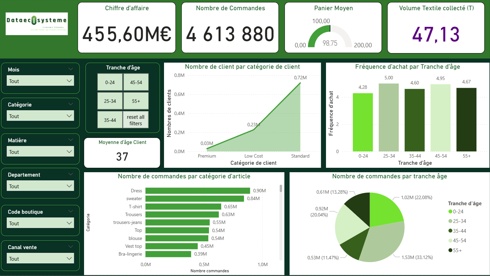
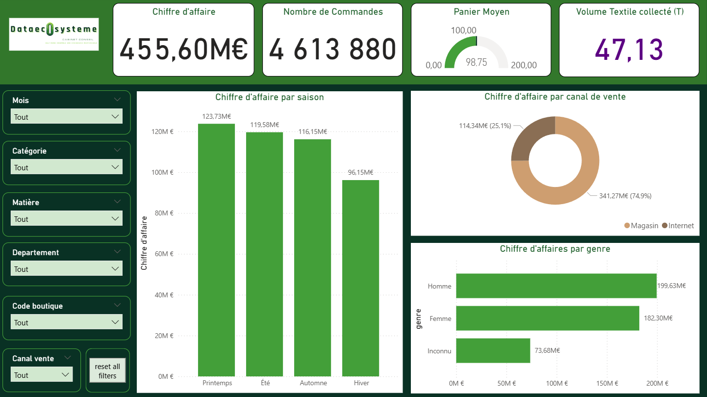
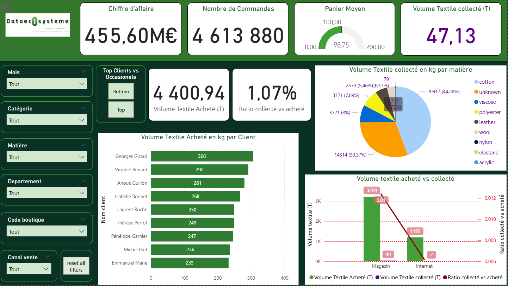
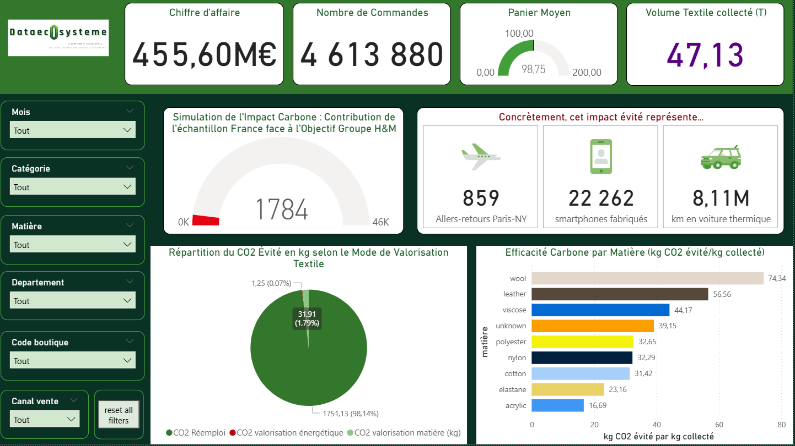
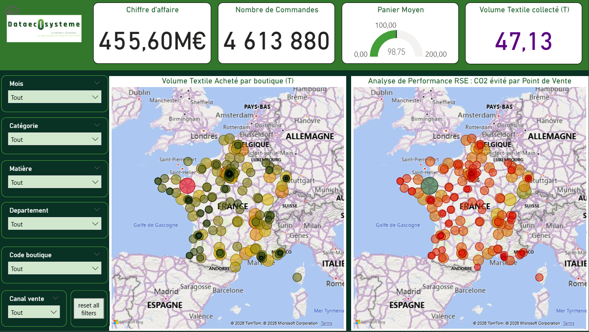

# ♻️ H&M Circularity Insight  
## Équilibre entre Performance Financière et Impact Carbone

## 📌 Contexte du projet

Dans le cadre d’un projet de Data Analysis, notre équipe a travaillé sur un cas d’usage autour de la **mode circulaire** et de l’impact environnemental de l’industrie textile.

L’objectif est d’analyser **comment H&M pourrait optimiser son programme de collecte de vêtements** afin de réduire son empreinte carbone tout en maintenant de bonnes performances financières.

Le projet combine :
- analyse des ventes
- simulation de collecte textile
- estimation de CO2 évité
- visualisation décisionnelle dans Power BI

---

# 🎯 Problématique

**Comment H&M peut-il optimiser son programme de collecte textile afin de réduire son empreinte carbone sans fragiliser sa rentabilité ?**

Pour répondre à cette question, nous avons construit un **dashboard décisionnel** permettant d’analyser simultanément :

- la performance commerciale
- le comportement des clients
- l’efficacité environnementale du programme de collecte

---

# 📊 Dataset

Le projet repose sur le dataset public :

**H&M Personalized Fashion Recommendations**

🔗 https://www.kaggle.com/competitions/h-and-m-personalized-fashion-recommendations

Les fichiers originaux étant très volumineux (plusieurs Go), ils ne sont pas inclus dans ce repository.

Ce dataset contient :

- plus de **30 millions de transactions**
- des informations sur :
  - les clients
  - les produits
  - les achats
  - les canaux de vente

Pour faciliter l’analyse, nous avons limité l’étude à **l’année 2019**.

---

# ⚙️ Préparation des données

La phase de préparation a été réalisée avec **Python (Pandas & DuckDB)**.

Les principales étapes :

### Nettoyage des données
- suppression des doublons
- gestion des valeurs manquantes
- filtrage sur l'année **2019**

### Enrichissement du dataset
Ajout de plusieurs variables analytiques :

- estimation du **poids des vêtements**
- estimation du **CO2 généré à la production**
- classification des articles par **matière textile**

### Simulation du programme de collecte

Le dataset ne contenant pas d’information sur les vêtements recyclés, nous avons simulé la collecte à partir :

- du volume total collecté par H&M en 2019  
**29 005 tonnes**

Nous avons ensuite appliqué un **prorata basé sur les ventes** afin d'estimer la collecte par magasin et par zone géographique.

---

# 📈 KPIs analysés

## 💰 KPIs Financiers

Ces indicateurs permettent d’évaluer la performance commerciale :

- chiffre d’affaires global
- panier moyen
- prix moyen par article
- volume de ventes par catégorie
- chiffre d’affaires par saison
- chiffre d’affaires par genre
- chiffre d’affaires par canal de vente (magasin / ecommerce)
- fréquence d'achat par tranche d'âge
- segmentation clients selon leur comportement d'achat

---

## ♻️ KPIs Environnementaux

### Impact carbone total

- **CO2 évité grâce au programme de collecte**

Le résultat est traduit en équivalences concrètes :

- trajets **Paris ↔ New York en avion**
- fabrication de **smartphones**
- kilomètres parcourus en **voiture thermique**

---

### Performance carbone par matière

Analyse de l’efficacité environnementale selon la matière textile :

- coton
- laine
- polyester
- nylon
- viscose

Objectif : identifier quelles matières ont le **meilleur impact environnemental lorsqu'elles sont recyclées**.

---

### Répartition des bénéfices environnementaux

Le gain carbone est décomposé en trois modes de valorisation :

- **Réutilisation**
- **Recyclage matière**
- **Valorisation énergétique**

Cette analyse permet de confirmer que **la réutilisation est la stratégie la plus efficace**.

---

### Analyse géographique

Une carte permet d'identifier :

- les zones où la collecte textile est la plus performante
- les zones nécessitant davantage de sensibilisation au recyclage

---

# 📊 Dashboard Power BI

Le dashboard permet une analyse complète selon deux perspectives :

### 📈 Vision Finance

- chiffre d'affaires global
- performance par catégorie
- comportement d'achat client
- segmentation marketing

### 🌍 Vision RSE

- volume textile collecté
- CO2 évité
- efficacité environnementale par matière
- performance géographique des points de vente

---

# 📸 Aperçu du dashboard

### Vue générale


### Analyse des ventes


### Analyse des achats


### Volume textile


### Analyse CO2 et impact environnemental


### Comparaison ventes vs collecte


## 📥 Télécharger le dashboard Power BI

Le fichier Power BI complet peut être téléchargé ici :

👉 https://drive.google.com/file/d/1YWHpHd53CAhI_bt3RrNrrNJIPcPB1PqN/view?usp=sharing

⚠️ Le fichier n'est pas inclus dans ce repository en raison de sa taille importante.
---
## 📊 Insights et enseignements

L'analyse des données met en évidence plusieurs tendances importantes :

• La majorité du chiffre d'affaires provient des ventes en **magasin physique**, confirmant que le retail reste le principal canal de distribution.

• Les **clients âgés de 25 à 34 ans** représentent l'un des segments les plus actifs en termes de fréquence d'achat.

• Certaines catégories d'articles concentrent une part importante des ventes, ce qui permet d'identifier les **produits à fort potentiel commercial**.

• La simulation de collecte textile montre que la **réutilisation des vêtements génère l'impact carbone évité le plus important**, devant le recyclage matière ou la valorisation énergétique.

• L'analyse par matière révèle que certaines fibres, comme la **laine ou le cuir**, présentent une efficacité carbone plus élevée lorsqu'elles sont réutilisées.

Ces résultats permettent d'identifier des leviers d'action pour améliorer à la fois la performance économique et l'impact environnemental du programme de circularité.
---
## 💡 Recommandations

À partir de ces analyses, plusieurs pistes d'amélioration peuvent être envisagées :

• renforcer la communication autour du programme de collecte textile en magasin, où la fréquentation client est la plus forte

• cibler les segments de clients les plus actifs pour encourager le retour des vêtements usagés

• mettre en avant les produits et matières ayant le meilleur potentiel de **réutilisation et d'impact carbone évité**

Ces analyses peuvent aider H&M à optimiser son programme de circularité tout en préservant sa performance commerciale.
---
# 🧠 Méthodes utilisées

- Python
- Pandas
- DuckDB
- Power BI
- DAX
- Simulation de données
- Analyse KPI

---

# 🗂 Structure du projet

```
hm-circularity-insight
│
├── notebooks
│ └── data_cleaning_transactions.ipynb
│ └── data_cleaning_customers.ipynb
│
├── images
│ └── hm_vue_generale.PNG
│ └── hm_achats.PNG
│ └── hm_ventes.PNG
│ └── hm_volume.PNG
│ └── hm_co2.PNG
│ └── hm_comparaison.PNG
│
└── README.md
```

---

# 🚧 Difficultés rencontrées

- dataset extrêmement volumineux (plus de 30 millions de transactions)
- absence de données réelles sur la collecte textile
- nécessité de créer un modèle de **simulation réaliste**
- harmonisation de nombreuses sources de données environnementales

---

# 💡 Enseignements du projet

Ce projet montre que la **mode circulaire peut devenir un levier stratégique** :

- réduction de l’impact carbone
- amélioration de l’image de marque
- opportunités de croissance via la seconde main

---

# 🛠 Compétences développées

- data cleaning sur grands datasets
- enrichissement et modélisation de données
- simulation de variables métiers
- construction d'indicateurs environnementaux
- data visualisation avec Power BI
- analyse stratégique mêlant **finance et impact environnemental**

## 👨‍💻 Contribution personnelle

Ce projet a été réalisé en équipe dans le cadre d'un projet de Data Analysis.

Mes contributions principales ont été :

- participation au **nettoyage et à la préparation des données**
- traitement du dataset **transactions_train**
- participation au nettoyage et à la préparation du dataset **customers**
- création de la **vue générale du dashboard Power BI**
- développement de la page **analyse des achats et du chiffre d'affaires**
- participation à la définition et au calcul des **KPIs financiers**

